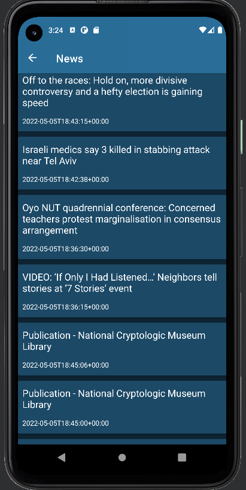

# btu_android_final

A notes application with [MVVM architecture](https://developer.android.com/jetpack/guide).
Built with components like Coroutines, ViewModel, Room, Navigation component, Retrofit, Gson etc.

#### This App showcases:

* Integration with Architecture Components: Navigation, ViewModel, Room
* Using Retrofit to fetch news from API

This is the first step soon it will becoming a full fledged Notes application with all the desired features
currently this is the first phase which included a basic working good Ui App.

Screenshots
-----------

  
  

  
  

